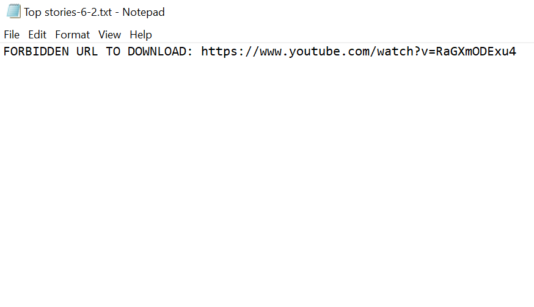

# Google News RSS Aggregator and Parser

Colin Murphy, Dan Sigmans, Josiah Kupier, Matt Merenich
DSCI-511
Professor Jake Williams
README.md

Welcome to the README file for the Google News RSS Aggregator and Parser project.

This project utilizes the RSS feeds of various Google News topics to collect individual article text, html, and metadata by topic - this can be called periodically.


## Prerequisites

What things you need to install the software and how to install them

```
Feedparser:
    install files: https://pypi.org/project/feedparser/
    pip install feedparser

Newspaper:
    Should be included in python library
    pip install newspaper

Common modules you'll need:
    Should be included in python library
    urllib, json, os, re, bs4, collection, datetime
```


## Getting Started

##### Creating the RssClass instance:
myRSS = RssClass(topic = 'topic')
    
    __init__(url = 'https://news.google.com/', topic = 'Top stories'):
    
        By default, the url is set to news.google.com and the topic is 'Top stories'.  Currently, this class and it's functions are designed to parse through news.google.com's particular RSS feed structure.  Any key word can be entered into the topic variable - if the key word is not part of news.google.com's homepage topics, a new RSS feed will be created and added to the topics dict - see below.
 
        RssClass.topics:
        
            Topic link extensions are scraped from news.google.com homepage - [Top stories, World, Local stories, Business, Technology, Entertainment, Sports, Science, Health]. The topics and their links are stored in a dict structure.  Any RSS feeds that are not available will not stored (e.g. the Local stories RSS feed did not appear to exists, so it is not stored in the dict).
            
        RssClass.souped:
        
            Upon initiation, the RSS feeds will be parsed by feedparser and the summary from each entry will be added to a list by topic.  The summary is held as a BeautifulSoup object to easily parse through.

##### Gathering data for a particular topic:
myRSS.headline_summary('topic')
    
            headline_summary(topic = 'Top stories'):
                The headline_summary function is the primary function of the the module. It will parse through the specified topic and create the database for that topic...

            {.data/topic:
            
                    .data/topic/story_grp_ID
                    .data/topic/story_meta.json:
                    
                        .data/topic/story_grp_ID/unique_stry_ID.txt
                        .data/topic/story_grp_ID/unique_stry_ID-html.txt
                        .data/topic/story_grp_ID/article_metadata.json}

 - Any articles that cannot be access will return 'FORBIDDEN URL TO DOWNLOAD' attributes.            
 - .data/topic/story_meta.json 
     - {Unique Story Group ID:{"Group Headline":the title of the leading story of the group,"Outlets":A list of all news outlets within the group}}
 
 - .data/topic/story_grp_ID/unique_stry_ID.txt
     - full text of the article
 - .data/topic/story_grp_ID/unique_stry_ID-html.txt
     - full original html of the article webpage as a txt file
 - .data/topic/story_grp_ID/article_metadata.json
     - {Unique Article ID:{'Article Title': title of the article,'Publish Date':date the article was published, 'Author(s)':list of authors (note: this is prone to errors with the newspaper module), 'Link':original link to the article}

                
                
##### Gathering data for all topics:
for topic in myRSS.topics:
    myRSS.headline_summary('topic')


### Deploying the code

Create the instance of the RSS class and specify any special topic keyword you would like to use:

```
    myRSS = RssClass(topic = 'topic')

    for topic in myRSS.topics:
        myRSS.headline_summary('topic')
    
```

And access the data - example of accessing the first article of the first story_group for each topic:

```


for topic in test.topics:
    with open(f"./data/{topic}/story_meta.json", 'r') as f:
        stry_group_data = json.load(f)
        for story_group_ID in stry_group_data:
            with open(f"./data/{topic}/{story_group_ID}/article_metadata.json", 'r') as f:
                article_data = json.load(f)
                for article_ID in article_data:
                    print(article_ID)
                    print(article_data[article_ID]['Link'])
                    with open(f"./data/{topic}/{story_group_ID}/{article_ID}.txt", 'r') as f:
                        article_txt = f.read()
                    print(article_txt)
                    break
                break
```

This will print the article ID in the database, the link to the article, and the text of the article.

The precise deployment of the code to obtain periodic RSS feed data is left to the end user; however, it is recommended that a scheduler utility such as Crontab be used to execute the code, creating a timestamped directory for each new execution.

## Initial challenges

##### Google News RSS Feed Structure
The code focuses on the google news RSS feeds due to their unqiue structure. Instructions for obtaining the new RSS feeds were previously given in the Google Product Forums, but those instructions no longer appear to work since RSS options are nowhere to be found within Google News pages.

The initial objective of the code is to navigate the google news RSS feeds - the RSS URLs do not appear to be intuitive with some exceptions such as the search method, “https://news.google.com/rss/search?q=[INPUT]", thus the extensions for news topics are scraped from the front page of news.google.com

  
    url = 'https://news.google.com/'
    html_text = urllib.request.urlopen(url).read()

    soup = BeautifulSoup(html_text, 'html.parser')
    soup_body = soup.find('body')
    topic_key = 'aria-label'

    self.topics = 
    {i.get('aria-label'): url+'rss'+i.get('href').strip('.') for i in soup_body('a')if i.get('class') == ['SFllF'] and feedparser.parse(url+'rss'+i.get('href').strip('.')).entries[0].title != 'This feed is not available.'}    

Additionally, google news RSS feeds appear to aggregate articles with a similar headline or theme and presents them as a 'summary' of each RSS entry (anywhere from 1-5 stories per group, with the Link, News Outlet, and Title of each article being given in the summary).  This differs from other most other RSS feeds, because RSS feeds will typically seperate each article as a single 'entry' and provide the metadata for that article (i.e. the 'summary' atribute will include an actual synopsis of the article entry).  

Below is an example of a google news RSS entry (top) and a Yahoo News RSS entry (bottom):

   

   


##### Newspaper Forbidden URL
Use of the newspaper module makes for a simple execution of code to obtain the most important data from articles.  However, some sites may block the module from doing so, thus breaking the code with the error: "FORBIDDEN URL TO DOWNLOAD".  

In these cases, an exception will return the "FORBIDDEN URL TO DOWNLOAD" for all data that could not be obtained:

   


## Areas for improvement:

With this current infrastructure, there is no method for ensuring that redundant data is skip (i.e. we do not store the same article if it has been previously acquired).

In a future revision, this can be achieved by simply storing first the RSS feed 'updated' attribute -  

    rssfeed['feed']['updated']

- and secondly, the individual article links each in a separate file - the RSS feed update time will be held for each RSS feed and the links across all topics will be held in a master file.  The code can then look to first see if the RSS feed has updated since last pull before parsing through the entire feed, then check the individual link before storing it. 

#### Acknowledgments

* The members of this project would like to acknowledge the support and guidance provided by Professor Jake Williams and the TAs of DSCI511.
